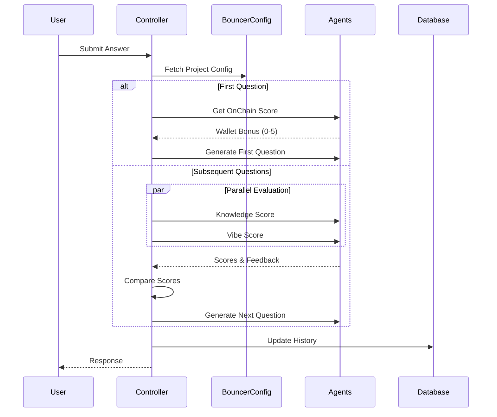

# Bouncer AI 🎭

Bouncer AI is a token launchpad of AI-powered 'bouncers' that access-restrict who can buy tokens and at what amount, based on a user's knowledge, vibe, wallet, and other custom metrics. With bouncer AI, project creators easily configure AI-driven evaluators for their token launch, ensuring that tokenholder are aligned with the project's long term vision.

## Features

- 🤖 AI-powered bouncer interaction
- 🔐 Web3 authentication with Privy
- 💬 Natural language processing for user interactions
- 🎫 Token-gated access system
- 🌐 Modern, responsive web interface

## Tech Stack

- **Design**: Prototyped and refined in **Figma**
- **Frontend**: Built with **Next.js** and deployed on **Vercel**
- **Backend**: Implemented in **Node.js** (TypeScript, Express, Redis) and deployed on a **Droplet**
- **Smart Contracts**: Developed with **Foundry** and deployed on **Arbitrum**
- **Database**: Managed via **Supabase**
- **AI Agent Framework**: **Covalent AI SDK**

---

### Frontend

Our frontend is built with **Next.js**. It was designed in **Figma**, then implemented with **TailwindCSS** for a responsive UI. Users authenticate via **Privy**, receiving JWT tokens that secure subsequent interactions with the backend.

For visualizing token price data, we integrated the **TradingView Charting Library**, enabling real-time chart updates. Additionally, the **bouncer avatar** was designed in **Spline** to enhance user interaction. In the future, the avatar may dynamically react to user responses.

---

### Backend

The backend is built in **TypeScript** using **Node.js** and **Express**, with **Redis** for session management and **Supabase** for data storage.

#### Session Handling

- User sessions are created in **Redis** after verifying **Privy-provided cookies**, ensuring secure authentication and state management.

#### Agent Integration

- Once authenticated, user interactions (including project context) are forwarded to the **AI agent component**. These interactions are stored, maintaining a complete record of each user's progress.

#### Token Allocation & Signature Generation

- If a user **passes the bouncer** (meets the required knowledge and vibe criteria), the backend determines the **token allocation**.
- A **secure signature** (with a nonce to prevent reuse) is generated for users to purchase tokens up to their allocated limit.

#### Price Tracking

- A continuous **backend script** monitors all active projects, fetching and updating their current prices in **Supabase**.
- The **frontend** then retrieves this data to render **real-time price charts** using **TradingView**, providing users with up-to-date insights into token performance.

---

### Database

We use **Supabase** as our database to store:

- User metadata
- Project configurations
- Project interaction data
- Historical price data for every project contract

---

### Smart Contracts

We use a **factory smart contract** to deploy a **unique token contract per project**. These token contracts employ a **linear bonding curve**, with curve parameters set at deployment via the factory contract.

#### Liquidity Management

- Each token contract **holds both ETH and its corresponding tokens** until the bonding curve reaches **maturity**.
- **Transfers are restricted**—only the token contract itself can facilitate transactions—preventing secondary markets from **bypassing the bouncer**.

#### Core Functions

- **`buy()`**: Allows token purchases on the bonding curve, up to an **agent-set allocation**, validated via a **signature**.
- **`sell()`**: Enables users to **sell tokens** back at any time on the bonding curve.
- **`deployLiquidity()`**: Once maturity is reached, **anyone** can deploy liquidity (**ETH + tokens**) into **Uniswap**, finalizing the tradable market.

---

### AI Agent Framework

Our **AI bouncer** is powered by **Covalent AI SDK**, structured into two core workflows—**Interaction** and **Briefing**—to optimize user engagement and configuration.

#### Interaction Workflow

##### Parallel Evaluation Agents

- **Multiple evaluation agents** run **in parallel**.
- Currently, we use **two agents**—a **Knowledge Agent** and a **Vibe Agent**—but the framework allows for future expansion.
- Each agent **independently scores** responses and drafts a **follow-up question**.

##### Subsequent Question Agent

- After evaluation, a **Question Agent** refines the **most relevant follow-up question** (knowledge or vibe) to match the project's **tone and style**.

##### Adaptive Questioning

- Users typically receive **3–5 questions**.
- If responses are **weak**, the interaction **ends early**.
- If the user's score meets the threshold, the system selects whether to ask a **Knowledge or Vibe** question next—maintaining a **dynamic, context-aware flow**.

---

#### Briefing Workflow

##### Project Setup

When creating a new project, users configure the bouncer by defining:

- **Knowledge Check**: A text summary or uploaded **whitepaper** (processed by a **Whitepaper Agent**) forms the **knowledge base**.
- **Vibe Check**: A list of **descriptive adjectives** that shape the **Vibe Agent's** assessment.
- **Bouncer Attitude**: A set of **adjectives** guiding the **Question Agent's** tone and interaction style.

##### Prompt Engineering

- Each agent's **system prompt** is carefully crafted to ensure that **user-defined configurations** directly influence agent behavior.
- This guarantees that the **bouncer aligns seamlessly** with the project's **brand, style, and difficulty requirements**.

##### Briefing Agent (Future Expansion)

- A **Briefing Agent** will be introduced to guide users through **project setup**, ensuring **optimal configuration**.
- A **playground environment** will allow users to **fine-tune** the bouncer's behavior interactively.

### Scoring Criteria

**Knowledge Score:**

- 0-3: Poor understanding
- 4-6: Basic understanding
- 7-8: Good understanding
- 9-10: Excellent understanding

**Vibe Score:**

- 0-3: Poor cultural fit
- 4-6: Basic alignment
- 7-8: Good cultural fit
- 9-10: Perfect alignment

### Character Choices

- Stoic: Minimal emotion, fact-focused
- Funny: Witty with serious evaluation
- Aggressive: Direct and challenging
- Friendly: Warm but maintaining standards

## Project Structure

```
ethglobal-agent/
├── evm/               # Smart contract development
│   ├── src/          # Contract source files
│   ├── script/       # Deployment scripts
│   └── test/         # Contract test files
│
├── frontend/         # Next.js frontend application
│   ├── app/         # Next.js 13+ app directory
│   ├── components/  # Reusable UI components
│   ├── clients/     # API client integrations
│   ├── constants/   # Global constants and configs
│   ├── assets/      # Static assets and images
│   └── styles/      # Global styles and themes
│
├── server/          # Main backend Node.js server
│   └── src/
│       ├── agents/      # AI agent implementations
│       ├── controllers/ # Request handlers
│       ├── services/    # Business logic
│       ├── routes/      # API routes
│       ├── middlewares/ # Express middlewares
│       ├── database/    # Database configurations
│       └── types/       # TypeScript type definitions
│
└── token_tracker/   # Token price tracking service
    └── src/
        ├── services/    # Token tracking services
        ├── config/      # Service configuration
        └── types/       # TypeScript type definitions
```

## Getting Started

### Prerequisites

- Node.js (v16 or higher)
- npm
- A Web3 wallet (MetaMask recommended)

### Installation

1. Clone the repository:

```bash
cd ethglobal-agent
```

2. Install dependencies for both frontend and backend:

```bash
# Frontend
cd frontend
npm install

# Backend
cd ../server
npm install
```

3. Set up environment variables. Use the env.example file as a reference.

```bash
# Frontend (.env.local)
NEXT_PUBLIC_API_URL=your_api_url
NEXT_PUBLIC_PRIVY_APP_ID=your_privy_app_id

# Backend (.env)
PORT=3001
DATABASE_URL=your_database_url
```

4. Start the development servers:
   Open two terminals and run the following commands:

```bash
# Frontend
cd frontend
npm run dev

# Backend
cd server
npm run dev
```

The application should now be running at `http://localhost:3000`

## Contributing

Contributions are welcome! Please feel free to submit a Pull Request.

## License

This project is licensed under the MIT License - see the LICENSE file for details.

## Acknowledgments

- Built with ❤️ for ETHGlobal

## Agent Architecture (Covalent Implementation)

### Agent Workflow


The system uses Covalent AI SDK's multi-agent architecture for user evaluation:

### Core Agents

1. **Knowledge Score Agent**

   - Evaluates technical understanding using mandatory knowledge
   - Considers whitepaper context
   - Adapts strictness based on project configuration
   - Returns score (0-10) and feedback

2. **Vibe Score Agent**

   - Assesses cultural alignment and authenticity
   - Uses character-based evaluation
   - Considers project's community values
   - Returns score (0-10)

3. **Knowledge Question Generator**

   - Generates contextual technical questions
   - Progressive difficulty based on history
   - Incorporates mandatory knowledge checks
   - Avoids revealing project details directly

4. **Vibe Question Generator**

   - Creates culture-fit questions
   - Adapts tone to character choice
   - Tests community understanding
   - Maintains consistent persona

5. **OnChain Score Agent** (First Question Only)
   - Evaluates wallet activity
   - Checks token/NFT holdings
   - Provides bonus points (0-5)
   - Affects final scoring

### Evaluation Flow



### Scoring Process

1. **Initial Evaluation**

   ```typescript
   if (questionNumber === 0) {
   	// Get wallet bonus if available
   	const onChainScore = await onChainScoreAgent.evaluate(walletAddress);
   	// Generate first knowledge question
   	const firstQuestion = await knowledgeQuestionAgent.generate();
   }
   ```

2. **Regular Evaluation**

   ```typescript
   // Parallel score evaluation
   const [knowledgeScore, vibeScore] = await Promise.all([
   	knowledgeAgent.evaluate(question, answer, history),
   	vibeAgent.evaluate(question, answer, history),
   ]);

   // Apply wallet bonus
   const adjustedScores = {
   	knowledge: Math.min(10, knowledgeScore + bonus * 0.2),
   	vibe: Math.min(10, vibeScore + bonus * 0.2),
   };
   ```

3. **Decision Making**
   ```typescript
   const passed = adjustedKnowledgeScore >= 7 && adjustedVibeScore >= 8;
   const shouldContinue = !passed && questionNumber < 5;
   ```

### Configuration (from Supabase)

```typescript
interface BouncerConfig {
	mandatory_knowledge: string;
	project_desc: string;
	whitepaper_knowledge: string;
	character_choice: "stoic" | "funny" | "aggressive" | "friendly";
}
```

### Response Format

```typescript
interface EvaluationResponse {
	nextMessage: string | null;
	decision: "pending" | "passed" | "failed";
	shouldContinue: boolean;
	conversationState: ConversationState;
	knowledgeScore: number;
	vibeScore: number;
}
```

### Progression Rules

1. **Question Limits**

   - Minimum: 2 questions
   - Maximum: 5 questions
   - Early pass possible with exceptional scores

2. **Scoring Thresholds**

   ```typescript
   if (questionNumber > 5) {
   	passed = adjustedKnowledgeScore >= 7 && adjustedVibeScore >= 8;
   } else if (questionNumber >= 3) {
   	passed = adjustedKnowledgeScore >= 6 && adjustedVibeScore >= 7;
   } else if (questionNumber === 2) {
   	passed = adjustedKnowledgeScore >= 5 && adjustedVibeScore >= 6;
   }
   ```

3. **Immediate Failure Conditions**
   - Knowledge or Vibe score ≤ 1
   - Attempt to manipulate system
   - Revealing scoring criteria

### Character Implementation

Each character choice affects:

- Question tone and style
- Evaluation strictness
- Response formatting
- Feedback delivery

Example:

```typescript
const characterStyles = {
	stoic: "Ask questions with minimal emotion, focusing on facts",
	funny: "Include clever wordplay while maintaining seriousness",
	aggressive: "Frame questions challengingly but fairly",
	friendly: "Ask welcoming but probing questions",
};
```
